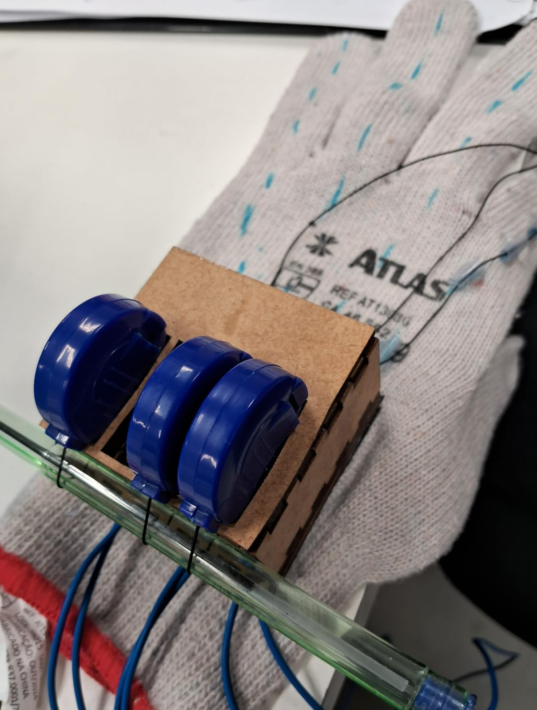

# AirBand
Os jogos musicais, embora populares, ainda dependem de periféricos específicos como guitarras e baterias, que ocupam espaço e apresentam custo elevado. Diante desse cenário, o projeto Air Band tem como objetivo desenvolver uma alternativa compacta e multifuncional: uma luva sensorizada capaz de substituir diferentes controladores tradicionais em um único dispositivo.

A luva contará com sensores de flexão e movimento, além de integração com uma webcam para captura dos gestos do usuário em tempo real. Esses dados serão processados e convertidos em comandos do jogo, possibilitando a simulação de diferentes modos (como guitarra, bateria e outros) de acordo com a configuração selecionada no software de apoio. O sistema busca oferecer praticidade, versatilidade e menor custo, sem comprometer a experiência de imersão característica dos jogos musicais.

[Cronograma](https://docs.google.com/spreadsheets/d/1t47Ufq2zki0159EHYryou9m896qojC0YicFVhhZcW6Q/edit?usp=sharing)
[Plano de projeto](imgs/PP_AirBand.pdf)
# Desenvolvimento do Projeto - Protótipo da Luva Interativa

## 09/09 - Construção do Protótipo

A primeira etapa do projeto envolve a construção do protótipo da luva, que será montada sobre uma base de MDF. A estrutura foi planejada com base no modelo 3D desenvolvido no Fusion 360, que servirá como guia para a montagem das camadas da luva.

### Etapas da Construção

A luva será formada por várias camadas, de modo que sua construção imite o modelo de exemplo que temos como referência. O objetivo é garantir precisão no design e funcionalidade do protótipo. 

Veja o modelo 3D criado no **Fusion 360**:

### Referência do Modelo de Exemplo

A estrutura do protótipo será inspirada em um design 3D de exemplo no **Tinkercad**.

[Modelo no Tinkercad](https://www.tinkercad.com/things/4D4zS8COB8K-shiny-kup-fyyran/edit?returnTo=https%3A%2F%2Fwww.tinkercad.com%2Fdashboard&sharecode=UVHHCoMKiPKIRVZKPQqXZzOaWMGkzx-22mJVrR5R0As)

## Próximos Passos

No dia **13/09**, os alunos participarão do **Workshop: Modelagem CNC para Corte a Laser**, com o objetivo de aprender as técnicas necessárias para preparar os protótipos para o corte.

---
## Densenvolvimento até 08/10

### Sensores
Testamos o funcionamento do ESP 32, do acelerômetro, do giroscópio e do potênciometro. 

### Mecânica da Luva
Após participar do Workshop, desenvolvemos e cortamos os dois modelos de MDF.
Vídeo de comparativo dos dois modelos em MDF feitos:

link: https://www.youtube.com/watch?v=WJLIjmnFiwk&feature=youtu.be

### Câmera
Testamos o reconhecimento das mãos em diferentes ambientes.

### Interface gráfica 
Inicializamos o desenvolvimento da interface gráfica. Foi feita em python.  

### Imagens adicionais

### Próximos Passos
Agora vamos realizar a diferenciação da mão nos quadrantes usando a câmera, integrar os sensores com a interface gráfica e continuar trabalhando na mecânica da luva.

